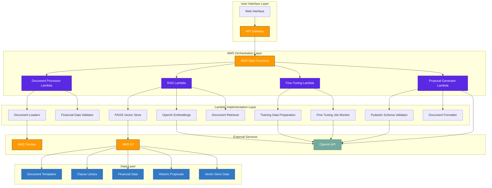

# Banking Proposal Generator Component Diagram

```mermaid
graph TD
    subgraph "User Interface Layer"
        UI[Web Interface] --> API[API Gateway]
    end
    
    subgraph "AWS Orchestration Layer"
        API --> StepFunctions[AWS Step Functions]
        StepFunctions --> DocProcLambda[Document Processor Lambda]
        StepFunctions --> RAGLambda[RAG Lambda]
        StepFunctions --> FineTuneLambda[Fine-Tuning Lambda]
        StepFunctions --> PropGenLambda[Proposal Generator Lambda]
    end
    
    subgraph "Lambda Implementation Layer"
        DocProcLambda --> DocLoader[Document Loaders]
        DocProcLambda --> DataValidator[Financial Data Validator]
        
        RAGLambda --> VectorStore[FAISS Vector Store]
        RAGLambda --> Embeddings[OpenAI Embeddings]
        RAGLambda --> Retriever[Document Retriever]
        
        FineTuneLambda --> TrainingPrep[Training Data Preparation]
        FineTuneLambda --> JobMonitor[Fine-Tuning Job Monitor]
        
        PropGenLambda --> SchemaValidator[Pydantic Schema Validator]
        PropGenLambda --> DocFormatter[Document Formatter]
    end
    
    subgraph "External Services"
        DocLoader --> TextractAPI[AWS Textract]
        Embeddings --> OpenAIAPI[OpenAI API]
        VectorStore --> S3Storage[AWS S3]
        TrainingPrep --> OpenAIAPI
        JobMonitor --> OpenAIAPI
        PropGenLambda --> OpenAIAPI
        SchemaValidator --> OpenAIAPI
    end
    
    subgraph "Data Layer"
        S3Storage --> DocTemplates[Document Templates]
        S3Storage --> ClauseLibrary[Clause Library]
        S3Storage --> FinancialData[Financial Data]
        S3Storage --> HistoricProposals[Historic Proposals]
        S3Storage --> VectorStoreData[Vector Store Data]
    end
    
    classDef aws fill:#FF9900,stroke:#232F3E,color:white;
    classDef openai fill:#74AA9C,stroke:#127D67,color:white;
    classDef data fill:#3178C6,stroke:#235A97,color:white;
    classDef lambda fill:#5A29E4,stroke:#4320A5,color:white;
    
    class API,StepFunctions,TextractAPI,S3Storage aws;
    class OpenAIAPI openai;
    class DocTemplates,ClauseLibrary,FinancialData,HistoricProposals,VectorStoreData data;
    class DocProcLambda,RAGLambda,FineTuneLambda,PropGenLambda lambda;
```