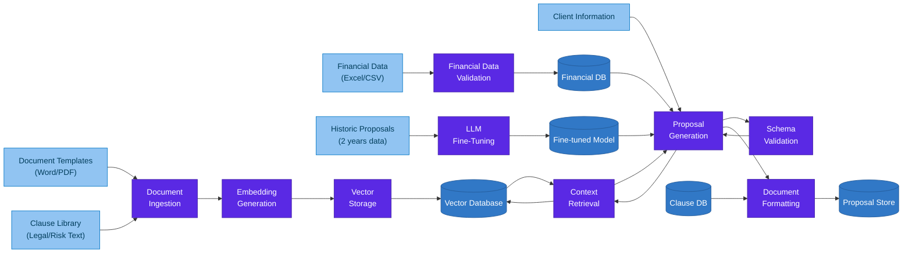

# Banking Proposal Generator Data Flow Diagram

```mermaid
flowchart LR
    %% Data Sources
    Templates["Document Templates\n(Word/PDF)"]
    ClauseLib["Clause Library\n(Legal/Risk Text)"]
    FinData["Financial Data\n(Excel/CSV)"]
    ClientInfo["Client Information"]
    HistoricProps["Historic Proposals\n(2 years data)"]
    
    %% Processes
    DocIngest["Document\nIngestion"]
    FinValidate["Financial Data\nValidation"]
    EmbedGen["Embedding\nGeneration"]
    VecStore["Vector\nStorage"]
    FineTune["LLM\nFine-Tuning"]
    Context["Context\nRetrieval"]
    PropGen["Proposal\nGeneration"]
    SchemaVal["Schema\nValidation"]
    DocFormat["Document\nFormatting"]
    
    %% Data Stores
    DB_Vec[("Vector Database")]
    DB_Fin[("Financial DB")]
    DB_Clause[("Clause DB")]
    S3_Props[("Proposal Store")]
    S3_Model[("Fine-tuned Model")]
    
    %% Data Flow
    Templates --> DocIngest
    ClauseLib --> DocIngest
    DocIngest --> EmbedGen
    EmbedGen --> VecStore
    VecStore --> DB_Vec
    
    HistoricProps --> FineTune
    FineTune --> S3_Model
    
    ClientInfo --> PropGen
    FinData --> FinValidate
    FinValidate --> DB_Fin
    DB_Fin --> PropGen
    
    PropGen --> Context
    Context --> DB_Vec
    DB_Vec --> Context
    Context --> PropGen
    
    S3_Model --> PropGen
    PropGen --> SchemaVal
    SchemaVal --> PropGen
    
    DB_Clause --> DocFormat
    PropGen --> DocFormat
    DocFormat --> S3_Props
    
    classDef source fill:#91C4F2,stroke:#0075C4,color:#003D5B;
    classDef process fill:#5A29E4,stroke:#4320A5,color:white;
    classDef datastore fill:#3178C6,stroke:#235A97,color:white;
    
    class Templates,ClauseLib,FinData,ClientInfo,HistoricProps source;
    class DocIngest,FinValidate,EmbedGen,VecStore,FineTune,Context,PropGen,SchemaVal,DocFormat process;
    class DB_Vec,DB_Fin,DB_Clause,S3_Props,S3_Model datastore;
```