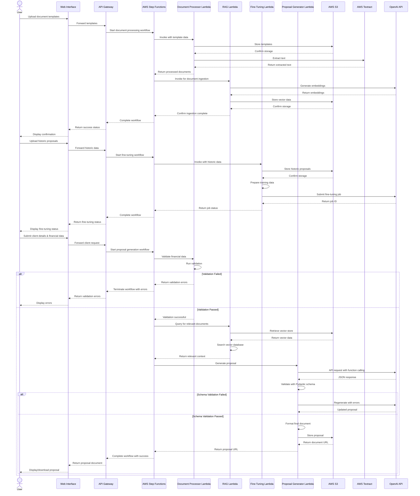

# Banking Proposal Generator Sequence Diagram

```mermaid
sequenceDiagram
    actor User
    participant UI as Web Interface
    participant API as API Gateway
    participant Step as AWS Step Functions
    participant DocLambda as Document Processor Lambda
    participant RAGLambda as RAG Lambda
    participant FineTuneLambda as Fine-Tuning Lambda
    participant PropGenLambda as Proposal Generator Lambda
    participant S3 as AWS S3
    participant Textract as AWS Textract
    participant OpenAI as OpenAI API
    
    %% System Setup Phase
    User->>UI: Upload document templates
    UI->>API: Forward templates
    API->>Step: Start document processing workflow
    Step->>DocLambda: Invoke with template data
    DocLambda->>S3: Store templates
    S3-->>DocLambda: Confirm storage
    DocLambda->>Textract: Extract text
    Textract-->>DocLambda: Return extracted text
    DocLambda-->>Step: Return processed documents
    Step->>RAGLambda: Invoke for document ingestion
    RAGLambda->>OpenAI: Generate embeddings
    OpenAI-->>RAGLambda: Return embeddings
    RAGLambda->>S3: Store vector data
    S3-->>RAGLambda: Confirm storage
    RAGLambda-->>Step: Confirm ingestion complete
    Step-->>API: Complete workflow
    API-->>UI: Return success status
    UI-->>User: Display confirmation
    
    %% Fine-Tuning Phase
    User->>UI: Upload historic proposals
    UI->>API: Forward historic data
    API->>Step: Start fine-tuning workflow
    Step->>FineTuneLambda: Invoke with historic data
    FineTuneLambda->>S3: Store historic proposals
    S3-->>FineTuneLambda: Confirm storage
    FineTuneLambda->>FineTuneLambda: Prepare training data
    FineTuneLambda->>OpenAI: Submit fine-tuning job
    OpenAI-->>FineTuneLambda: Return job ID
    FineTuneLambda-->>Step: Return job status
    Step-->>API: Complete workflow
    API-->>UI: Return fine-tuning status
    UI-->>User: Display fine-tuning status
    
    %% Proposal Generation Phase
    User->>UI: Submit client details & financial data
    UI->>API: Forward client request
    API->>Step: Start proposal generation workflow
    Step->>DocLambda: Validate financial data
    DocLambda->>DocLambda: Run validation
    
    alt Validation Failed
        DocLambda-->>Step: Return validation errors
        Step-->>API: Terminate workflow with errors
        API-->>UI: Return validation errors
        UI-->>User: Display errors
    else Validation Passed
        DocLambda-->>Step: Validation successful
        Step->>RAGLambda: Query for relevant documents
        RAGLambda->>S3: Retrieve vector store
        S3-->>RAGLambda: Return vector data
        RAGLambda->>RAGLambda: Search vector database
        RAGLambda-->>Step: Return relevant context
        
        Step->>PropGenLambda: Generate proposal
        PropGenLambda->>OpenAI: API request with function calling
        OpenAI-->>PropGenLambda: JSON response
        PropGenLambda->>PropGenLambda: Validate with Pydantic schema
        
        alt Schema Validation Failed
            PropGenLambda->>OpenAI: Regenerate with errors
            OpenAI-->>PropGenLambda: Updated proposal
        else Schema Validation Passed
            PropGenLambda->>PropGenLambda: Format final document
            PropGenLambda->>S3: Store proposal
            S3-->>PropGenLambda: Return document URL
            PropGenLambda-->>Step: Return proposal URL
            Step-->>API: Complete workflow with success
            API-->>UI: Return proposal document
            UI-->>User: Display/download proposal
        end
    end
```