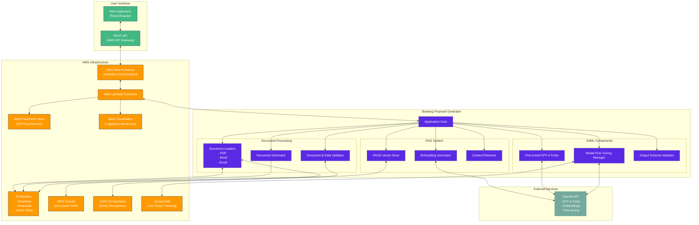

# Banking Proposal Generator System Architecture

```mermaid
flowchart TD
    subgraph "User Interface"
        WebApp["Web Application\n(React/Angular)"]
        API["REST API\n(AWS API Gateway)"]
    end
    
    subgraph "AWS Infrastructure"
        Lambda["AWS Lambda Functions"]
        S3["S3 Buckets\n- Templates\n- Proposals\n- Vector Store"]
        ParamStore["AWS Parameter Store\n(API Keys/Secrets)"]
        Textract["AWS Textract\n(Document OCR)"]
        Comprehend["AWS Comprehend\n(Entity Recognition)"]
        CloudWatch["AWS CloudWatch\n(Logging & Monitoring)"]
        StepFunc["AWS Step Functions\n(Workflow Orchestration)"]
        DynamoDB["DynamoDB\n(Job Status Tracking)"]
    end
    
    subgraph "Banking Proposal Generator"
        AppCore["Application Core"]
        
        subgraph "Document Processing"
            DocLoader["Document Loaders\n- PDF\n- Word\n- Excel"]
            DocValidator["Document & Data Validator"]
            DocFormatter["Document Generator"]
        end
        
        subgraph "RAG System"
            Embeddings["Embedding Generator"]
            VectorDB["FAISS Vector Store"]
            Retriever["Context Retriever"]
        end
        
        subgraph "AI/ML Components"
            GPT["Fine-tuned GPT-4-Turbo"]
            FineTuner["Model Fine-Tuning Manager"]
            SchemaValidator["Output Schema Validator"]
        end
    end
    
    subgraph "External Services"
        OpenAI["OpenAI API\n- GPT-4-Turbo\n- Embeddings\n- Fine-tuning"]
    end
    
    %% Connections
    WebApp <--> API
    API <--> StepFunc
    StepFunc <--> Lambda
    Lambda <--> AppCore
    
    AppCore --> DocLoader
    AppCore --> DocValidator
    AppCore --> DocFormatter
    AppCore --> Embeddings
    AppCore --> VectorDB
    AppCore --> Retriever
    AppCore --> GPT
    AppCore --> FineTuner
    AppCore --> SchemaValidator
    
    DocLoader <--> S3
    DocLoader <--> Textract
    DocValidator <--> Comprehend
    DocFormatter --> S3
    
    Embeddings <--> OpenAI
    GPT <--> OpenAI
    FineTuner <--> OpenAI
    FineTuner <--> DynamoDB
    
    Lambda --> ParamStore
    Lambda --> CloudWatch
    VectorDB <--> S3
    
    class WebApp,API frontendclass;
    class Lambda,S3,ParamStore,Textract,Comprehend,CloudWatch,StepFunc,DynamoDB awsclass;
    class OpenAI externalclass;
    class AppCore,DocLoader,DocValidator,DocFormatter,Embeddings,VectorDB,Retriever,GPT,FineTuner,SchemaValidator coreclass;
    
    classDef frontendclass fill:#42b883,stroke:#35495e,color:white;
    classDef awsclass fill:#FF9900,stroke:#232F3E,color:white;
    classDef externalclass fill:#74AA9C,stroke:#127D67,color:white;
    classDef coreclass fill:#5A29E4,stroke:#4320A5,color:white;
```